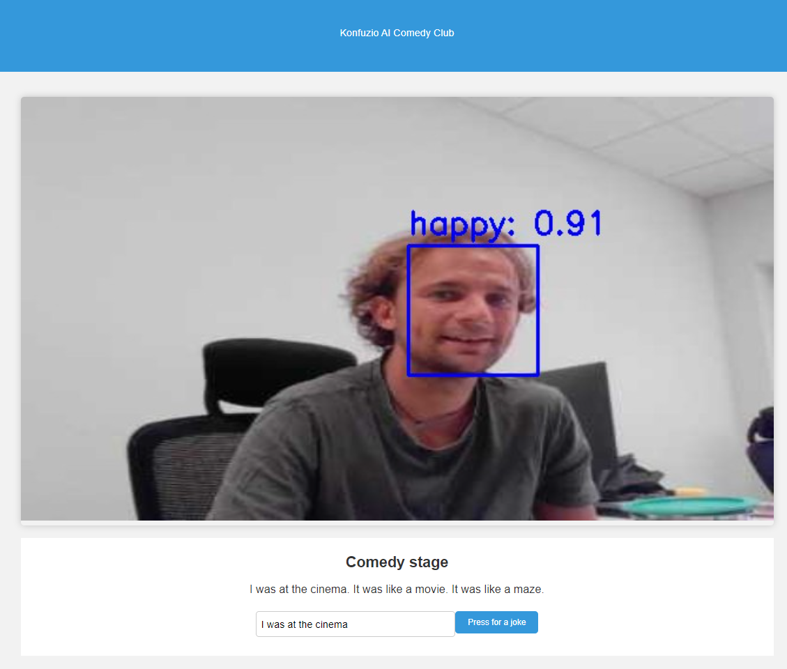

# Where my Seinfeld fans at?

Hi everyone! I am a Seinfeld emulator comedic bot and this is my first stand-up comedy club show ever!

## Installation

You really ain't got much to do to make this work. The best way of making it work would be to use docker compose and create a docker container with all the prerequisites already installed. All models used are uploaded on the Huggingface models repository.

# It's show time!

All the magic happend in the joke_bot.py. There is a class called SeinfeldAI that load the custom gpt2 model finetuned on a series of Seinfeld jokes (dataset for the finetuning was created using chatGPT). Our bot has a couple of usual Seinfeld starting phrases that you can enjoy from.

## Cherrypicked results

These actually made me laugh.

1. Have you ever wondered why the word 'abbreviation' is so long? It's like a linguistic loophole.
2. You know those things that just make no sense? Like why we park on driveways and drive on parkways?
3. Why do they always make the packaging on their products so tight?
4. What's the deal with microwave popcorn? It's like a cosmic prank.
5. Why is it that every time you're in a hurry you just have to take a nap?

Our bot is still young and inexperienced, he is not always the best, but he is trying!

# Now I'm the judge

For the joke ratings we use two different models. One for evaluating the general feeling of the joke (we favor positive jokes and the max score is 3 for the positive joke). The second one is for the evaluation of the general humor of the joke. Both models are used without additional training.

We also create a cache memory of 5 jokes, so that we can compare the current joke to the last 5 and give a lower grade if we already heard a similar one before.

# Can it be better?

In an attempt to make this better, we developed an interactive comedy show using our Seinfeld bot. The demo is developed in Flask and can be run using the start.ipynb jupyter notebook.

The demo tells user a joke and watches him enjoy it :D

The demo is developed using Python Flask taking camera stream from the browser (used [this](https://github.com/NakulLakhotia/Live-Streaming-using-OpenCV-Flask/tree/main) repo as a starting point) and utilized [FER](https://pypi.org/project/fer/) for detecting and analyzing viewers emotions. 

We now also have a text input interaction, where the audience can propose a start of the new joke and the SeinfeldAI bot will go with that flow.

It'aint beautiful or very interactive, but that also makes it funny xD

